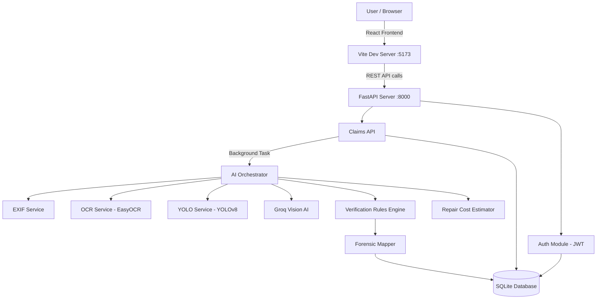

# 🎓 AutoClaim — Viva & Presentation Preparation Guide

---

## 1. Project Title & One-Liner

**AutoClaim — AI-Powered Vehicle Insurance Claim Processing System**

> *"An end-to-end web application that uses computer vision, OCR, and large language models to automate the verification and fraud detection of vehicle insurance claims."*

---

## 2. Problem Statement

Traditional vehicle insurance claim processing is:
- **Slow** — manual review takes days/weeks
- **Subjective** — depends on the agent's expertise
- **Fraud-prone** — fraudulent claims cost the industry billions annually
- **Costly** — requires dedicated human adjusters for every claim

**AutoClaim automates** the entire pipeline: a policyholder uploads damage photos, and the system uses AI to detect damage, verify the vehicle, check for forgery, estimate repair costs, and make an approval recommendation — all in seconds.

---

## 3. Tech Stack (Know These Cold)

| Layer | Technology | Purpose |
|-------|-----------|---------|
| **Frontend** | React 19 + Vite 7 | Single-page application |
| **UI** | Bootstrap 5 + Custom CSS | Responsive design |
| **Animations** | Framer Motion | Smooth UI transitions |
| **Icons** | Lucide React | Modern icon library |
| **Routing** | React Router DOM 7 | Client-side routing |
| **Backend** | FastAPI (Python) | REST API server |
| **Database** | SQLite + SQLAlchemy ORM | Data persistence |
| **Auth** | JWT (PyJWT) + OAuth2 | Token-based authentication |
| **Password Hashing** | Passlib (bcrypt) | Secure credential storage |
| **AI/ML — Damage Detection** | YOLOv8 (Ultralytics) | Self-hosted object detection |
| **AI/ML — Vision Analysis** | Groq API (LLaMA 4 Scout) | Multimodal data extraction |
| **OCR** | EasyOCR | License plate text recognition |
| **EXIF Extraction** | Pillow (PIL) | Image metadata (timestamp, GPS) |
| **Geocoding** | Geopy (Nominatim) | Reverse geocoding GPS→address |
| **Deep Learning** | PyTorch + TorchVision | Backend for YOLO model |

---

## 4. System Architecture



### Key Architectural Decisions
- **Asynchronous AI processing** — claim submission returns immediately; AI runs as a FastAPI `BackgroundTask`
- **Separation of extraction vs. decisions** — AI extracts facts, Python rules make approval decisions (deterministic)
- **Self-hosted YOLO** — no API cost for damage detection; GPU accelerated when available
- **Groq API** for vision analysis — fast inference, low cost

---

## 5. AI Pipeline (MOST IMPORTANT — Explain This Clearly)

When a user submits a claim, the pipeline runs in this exact order:

### Step 1: EXIF Metadata Extraction
- **Service**: `exif_service.py`
- **Input**: Uploaded images
- **Extracts**: Timestamp, GPS (lat/lon), camera make/model
- **Fallback**: Parses filename patterns (PXL_, IMG_, Samsung, WhatsApp, etc.)
- **Reverse geocoding**: Converts GPS→human-readable location via Nominatim

### Step 2: Number Plate OCR
- **Service**: `ocr_service.py`
- **Library**: EasyOCR (English)
- **Input**: Front image of vehicle
- **Logic**: Finds text 4–15 chars with both letters & numbers; picks highest-confidence match
- **Output**: Plate text + confidence score

### Step 3: YOLOv8 Object/Damage Detection
- **Service**: `yolov8_damage_service.py` + `yolo_service.py`
- **Model**: `yolov8n.pt` (YOLOv8 Nano — fast, lightweight)
- **Input**: All damage images
- **Detects**: Vehicles (car, truck, bus, motorcycle), damage regions
- **Output**: Bounding boxes, severity (minor/moderate/severe), affected parts, area percentage

### Step 4: Groq Vision AI — Data Extraction
- **Service**: `groq_service.py`
- **Model**: `meta-llama/llama-4-scout-17b-16e-instruct` (multimodal)
- **Approach**: Sends base64-encoded images with a structured extraction prompt
- **Extracts four categories**:
  1. **Identity** — make, model, year, color, plate visibility
  2. **Damage** — type (dent/scratch/crack/shatter/crush), severity 0–10, damaged panels, indicators (rust, glass, paint, airbags, fluid leaks)
  3. **Forensics** — screen recapture, UI elements, watermarks, image quality, lighting inconsistencies
  4. **Scene** — location type, time of day, weather, debris, other vehicles
- **Temperature**: 0.1 (low, for consistency)
- **Key design**: AI returns **facts only** — no judgments or recommendations

### Step 5: Rule-Based Verification
- **Service**: `verification_rules.py` (49,000 lines — comprehensive)
- **Input**: Structured data from Steps 1–4
- **Applies deterministic Python rules**:
  - License plate match check (detected vs. policy)
  - Severity classification
  - Pre-existing damage detection (rust, dirt, faded paint)
  - Forgery indicators (screen recapture, UI elements, watermarks)
  - Authenticity scoring (starts at 100, deducts for red flags)
  - Fraud probability assessment
  - Overall confidence score
- **Output**: APPROVE / REVIEW / REJECT recommendation

### Step 6: Repair Cost Estimation
- **Service**: `repair_estimator_service.py`
- **Maps**: Groq's `damaged_panels` → industry-standard USD price table
- **Coverage**: 30+ parts (bumpers, fenders, hood, doors, lights, mirrors, etc.)
- **Fuzzy matching**: Aliases map Groq's output variations to canonical keys
- **Currency**: Converts USD → INR at ₹84/USD
- **Output**: Part-by-part breakdown with min/max cost ranges

### Step 7: Forensic Mapping & Storage
- **Service**: `forensic_mapper.py`
- **Maps all AI results** → `ForensicAnalysis` database model
- **Computes**: Severity labels, authenticity scores, plate match, pre-existing damage confidence
- **Stores**: Everything in the database for frontend display and audit trail

---

## 6. Database Design (ER Diagram)

```mermaid
erDiagram
    User ||--o{ Claim : submits
    User ||--o{ Policy : owns
    PolicyPlan ||--o{ Policy : defines
    Policy ||--o{ Claim : covers
    Claim ||--o| ForensicAnalysis : has

    User {
        int id PK
        string email UK
        string hashed_password
        string role
        string name
        string policy_id
        string vehicle_number
    }

    PolicyPlan {
        int id PK
        string name
        text description
        int coverage_amount
        int premium_monthly
    }

    Policy {
        int id PK
        int user_id FK
        int plan_id FK
        string vehicle_make
        string vehicle_model
        int vehicle_year
        string vehicle_registration
        string status
        datetime start_date
        datetime end_date
    }

    Claim {
        int id PK
        int user_id FK
        int policy_id FK
        text description
        json image_paths
        string status
        string front_image_path
        string ai_recommendation
        int estimated_cost_min
        int estimated_cost_max
    }

    ForensicAnalysis {
        int id PK
        int claim_id FK_UK
        datetime exif_timestamp
        float exif_gps_lat
        float exif_gps_lon
        string ocr_plate_text
        boolean yolo_damage_detected
        string ai_damage_type
        float damage_severity_score
        float authenticity_score
        string ai_recommendation
        json repair_cost_breakdown
        float fraud_score
        string fraud_probability
    }
```

### Key Design Decisions
- **1:1 relationship** between Claim and ForensicAnalysis — each claim has exactly one forensic report
- **Denormalized fields** on Claim (vehicle_number_plate, ai_recommendation, costs) for fast dashboard queries
- **JSON columns** for flexible arrays (image_paths, detections, risk_flags, cost breakdown)
- **ForensicAnalysis** has **80+ fields** organized into 8 sections (EXIF, OCR, YOLO, Forensics, Vehicle ID, Damage, Risk, Final Assessment)

---

## 7. API Endpoints

### Authentication
| Method | Endpoint | Access | Purpose |
|--------|----------|--------|---------|
| POST | `/register` | Public | User self-registration |
| POST | `/login` | Public | Get JWT access token |
| GET | `/me` | Authenticated | Current user profile |
| POST | `/admin/register-agent` | Admin only | Create agent accounts |
| GET | `/admin/agents` | Admin only | List all agents |

### Claims
| Method | Endpoint | Access | Purpose |
|--------|----------|--------|---------|
| POST | `/claims/upload` | User | Submit claim with images |
| GET | `/claims/my-claims` | User | List user's own claims |
| GET | `/claims/all` | Admin | List all claims |
| GET | `/claims/{id}` | Owner/Admin | Full claim details + forensics |
| PUT | `/claims/{id}/status` | Admin | Update claim status |
| POST | `/claims/{id}/reanalyze` | Admin | Re-run AI analysis |

---

## 8. Frontend Pages & Components

| Route | Component | Role | Purpose |
|-------|-----------|------|---------|
| `/` | Homepage | Public | Landing page |
| `/login` | Login | Public | Email/password login |
| `/register` | Register | Public | User registration |
| `/submit-claim` | SubmitClaim | User | Upload damage images + description |
| `/dashboard` | UserDashboard | User | View my claims & statuses |
| `/claim/:id` | ViewClaim | Owner/Admin | Detailed forensic report & cost breakdown |
| `/agent` | AgentDashboard | Agent | View assigned claims |
| `/admin` | AdminDashboard | Admin | All claims, status management, agent registration |
| `/ai-test` | AITestPage | Authenticated | Test AI analysis directly |

### Key UI Features
- **Role-based routing** via `ProtectedRoute` component
- **JWT stored in localStorage** — decoded for role-based navbar
- **Animated dashboards** with Framer Motion
- **Detailed claim view** shows: images, EXIF data, OCR results, damage assessment, forgery analysis, cost breakdown

---

## 9. Role-Based Access Control (RBAC)

| Feature | User | Agent | Admin |
|---------|------|-------|-------|
| Register/Login | ✅ | ✅ | ✅ |
| Submit claims | ✅ | ❌ | ❌ |
| View own claims | ✅ | ❌ | ❌ |
| View all claims | ❌ | ✅ | ✅ |
| Update claim status | ❌ | ❌ | ✅ |
| Re-run AI analysis | ❌ | ❌ | ✅ |
| Register agents | ❌ | ❌ | ✅ |

---

## 10. Security Measures

- **Password hashing** — bcrypt via Passlib (never stored in plaintext)
- **JWT tokens** — HS256 signed, 60-minute expiry
- **OAuth2 password bearer flow** — standard token-based auth
- **Role enforcement** — `get_current_user` and `require_admin` dependency injection
- **CORS configured** — only allowed origins (localhost:5173, 5174, 3000)
- **File upload validation** — restricted to image types

---

## 11. Key Algorithms to Explain

### Authenticity Score Computation
```
Start at 100, deduct for red flags:
- Screen recapture detected → −30
- UI elements found → −20
- Watermarks found → −15
- Inconsistent shadows → −15
- Multiple light sources → −10
- Blurry image → −5
Minimum: 0
```

### Pre-existing Damage Confidence
```
Checks 4 indicators: rust present, dirt in damage, faded paint, missing parts
- 0 indicators → 0% confidence
- 1 indicator → 30%
- 2 indicators → 60%
- 3 indicators → 80%
- 4 indicators → 95%
```

### Fraud Probability Mapping
```
APPROVED → VERY_LOW
FLAGGED → MEDIUM
REJECTED → HIGH
```

---

## 12. Demo Walkthrough (For Presentation)

1. **Open browser** → Homepage at `localhost:5173`
2. **Register** a new user with email, password, name, policy number, vehicle number
3. **Login** → redirected to User Dashboard
4. **Submit Claim** → upload damage photos + front image + description
5. **Wait** for AI processing (background task, ~10-20 seconds)
6. **View Claim** → show the comprehensive forensic report:
   - 📸 Uploaded images
   - 🔍 EXIF metadata (timestamp, GPS, camera)
   - 🚗 Vehicle identification (make, model, color)
   - 🔢 License plate (OCR result + match status)
   - 💥 Damage assessment (type, severity, affected panels)
   - 🔬 Forensic analysis (authenticity score, forgery indicators)
   - 💰 Repair cost estimate (part-by-part breakdown in ₹)
   - ✅ AI recommendation (APPROVE / REVIEW / REJECT)
7. **Login as Admin** (`admin@autoclaim.com` / `admin123`)
8. **Admin Dashboard** → view all claims, update statuses, register agents

---

## 13. Expected Viva Questions & Answers

### Q1: "What is your project about?"
> AutoClaim is an AI-powered vehicle insurance claim processing system. When a policyholder is in an accident, they upload photos of the damage. Our system automatically verifies the vehicle identity, detects and classifies the damage, checks for fraud indicators like image manipulation or pre-existing damage, estimates repair costs, and makes an approval recommendation — all using AI and machine learning.

### Q2: "Why did you choose this tech stack?"
> - **FastAPI** for the backend because it's high-performance, has automatic API docs, and natively supports async background tasks for AI processing.
> - **React** for the frontend because of its component-based architecture and rich ecosystem.
> - **SQLite** for simplicity during development — easily swappable to PostgreSQL in production.
> - **YOLOv8** for damage detection because it's state-of-the-art, runs locally (no API cost), and supports GPU acceleration.
> - **Groq API with LLaMA 4** for vision analysis because it provides fast inference for multimodal prompts at low cost.
> - **EasyOCR** for license plate recognition because it handles multiple languages and is accurate on real-world images.

### Q3: "How does the AI work?"
> The AI pipeline has 6 stages: First, we extract EXIF metadata from images for timestamp and GPS verification. Second, EasyOCR reads the license plate from the front image. Third, YOLOv8 detects vehicles and damage regions in the photos. Fourth, Groq's multimodal AI extracts structured data — vehicle identity, damage details, forensic indicators, and scene context. Fifth, a Python rule engine applies deterministic verification logic and computes fraud scores. Sixth, a repair cost estimator maps damaged parts to industry-standard prices. The key design principle is that AI extracts facts, and code makes decisions — this makes the system deterministic and auditable.

### Q4: "How do you handle fraud detection?"
> We detect fraud through multiple layers:
> - **Image forensics**: Detecting screen recaptures, UI overlay elements, watermarks, and lighting inconsistencies
> - **Pre-existing damage**: Checking for rust, dirt in damage areas, faded paint around damage, and missing parts
> - **Metadata verification**: Cross-checking EXIF timestamps and GPS with the claim narrative
> - **Vehicle verification**: Comparing detected license plate against the policy's registered vehicle
> - Each red flag deducts from an authenticity score starting at 100. If the score drops significantly, the claim is flagged for human review.

### Q5: "What is the role of YOLO in your project?"
> YOLOv8 (You Only Look Once v8) is a real-time object detection model. We use the nano variant (`yolov8n.pt`) for its speed. It serves two purposes: (1) detecting and classifying vehicles in the image, and (2) identifying damage regions with bounding boxes, confidence scores, and severity assessment. It runs locally on the server, so we incur zero API costs. When a CUDA GPU is available, it automatically uses GPU acceleration.

### Q6: "Why not let the AI make the final decision directly?"
> Separating extraction from decision-making gives us three advantages:
> 1. **Deterministic** — the same inputs always produce the same decision (rules don't hallucinate)
> 2. **Auditable** — every decision can be traced to a specific rule
> 3. **Tunable** — we can adjust thresholds without retraining the AI model
> The AI is excellent at extracting visual data, but business rules should be controlled by code.

### Q7: "How do you estimate repair costs?"
> We maintain an industry-standard price table covering 30+ vehicle parts in USD (based on RepairPal and AAA data). When Groq identifies damaged panels (like "front_bumper", "hood", "headlight_l"), we map them to our price table using fuzzy alias matching. Each part has a min/max cost range. We sum all parts and convert to INR at ₹84/USD to give the user a localized estimate.

### Q8: "How do you handle asynchronous processing?"
> When a user submits a claim, the API saves the images and returns immediately with a "processing" status. The AI analysis runs as a FastAPI `BackgroundTask`. This means the user doesn't wait 10-20 seconds for AI processing. They can check their dashboard and see the claim status update from "processing" to "completed" once the AI finishes.

### Q9: "What database normalization did you apply?"
> We use 3NF normalization with five tables: Users, PolicyPlans, Policies, Claims, and ForensicAnalyses. PolicyPlans are separated from Policies (template vs. instance pattern). We intentionally denormalize a few fields on the Claims table (ai_recommendation, estimated costs) for fast dashboard queries, avoiding expensive joins.

### Q10: "What are the limitations of your system?"
> - The YOLOv8n model is pretrained on COCO dataset, not specifically trained on vehicle damage — a custom fine-tuned model would improve accuracy
> - OCR accuracy depends on image quality and plate visibility
> - Groq API availability is required for vision analysis
> - SQLite is single-writer; production would need PostgreSQL
> - No real-time notifications — users must refresh to see status updates

### Q11: "What would you improve in the future?"
> - Fine-tune YOLO on a vehicle damage dataset for better detection accuracy
> - Add WebSocket support for real-time claim status notifications
> - Implement a proper agent assignment and workflow system
> - Add image upload compression and CDN for production
> - Integrate with actual insurance policy databases
> - Add a mobile app for on-scene photo capture with GPS tagging
> - Implement multi-language support for regional license plates
> - Move to PostgreSQL for production scalability

### Q12: "How did you test the system?"
> We tested at multiple levels:
> - **Unit tests** for individual services (OCR, YOLO, Groq, EXIF)
> - **Integration tests** for the full AI pipeline (end-to-end claim analysis)
> - **Manual testing** with real vehicle damage images
> - **Database verification scripts** to validate data integrity
> - **API testing** via FastAPI's auto-generated Swagger docs at `/docs`

### Q13: "Explain the flow from claim submission to result."
> 1. User fills the claim form with description + damage images + front image
> 2. Frontend sends multipart form data to `POST /claims/upload`
> 3. Backend saves images to `uploads/` directory, creates a Claim record (status: "pending")
> 4. A background task is queued for AI analysis
> 5. Pipeline runs: EXIF → OCR → YOLO → Groq → Rules → Cost Estimation
> 6. Results are mapped to a ForensicAnalysis record and saved to the DB
> 7. Claim status is updated to "completed" with the AI recommendation
> 8. User visits their dashboard or claim detail page to see the full report

### Q14: "What is JWT and how did you implement it?"
> JWT (JSON Web Token) is a stateless authentication mechanism. When a user logs in with email/password, the server verifies credentials, creates a JWT containing the user's email, role, and user ID, signs it with HS256 using a secret key, and returns it. The frontend stores this token in localStorage and sends it in the `Authorization: Bearer <token>` header with every request. The server validates the token on each request using a dependency injection function (`get_current_user`). Tokens expire after 60 minutes.

### Q15: "What is EXIF data and why is it important for fraud detection?"
> EXIF (Exchangeable Image File Format) is metadata embedded in photos by cameras and phones. It includes timestamp, GPS coordinates, camera make/model, and more. For fraud detection, it's crucial because:
> - We can verify if the photo was taken at the claimed time and location
> - We can detect if images were taken with different cameras (suspicious)
> - Missing EXIF data might indicate image manipulation
> If EXIF is stripped, we fall back to parsing the filename for timestamp patterns.

---

## 14. How to Run the Project

### Backend
```bash
cd autoclaim_project/server
pip install -r requirements.txt
python run.py                    # Starts FastAPI on port 8000
```

### Frontend
```bash
cd autoclaim_project/client
npm install
npm run dev                      # Starts Vite on port 5173
```

### Default Credentials
| Role | Email | Password |
|------|-------|----------|
| Admin | admin@autoclaim.com | admin123 |
| User | user@example.com | user123 |

---

## 15. Key Files to Reference

| File | Purpose |
|------|---------|
| `server/app/main.py` | App entry point, startup, health check |
| `server/app/db/models.py` | All 5 database models (245 lines) |
| `server/app/api/claims.py` | Claim CRUD API routes |
| `server/app/api/auth.py` | Auth routes (register, login, agents) |
| `server/app/services/ai_orchestrator.py` | Main AI pipeline coordinator |
| `server/app/services/groq_service.py` | Groq vision AI integration |
| `server/app/services/yolov8_damage_service.py` | YOLO damage detection |
| `server/app/services/ocr_service.py` | License plate OCR |
| `server/app/services/exif_service.py` | Image metadata extraction |
| `server/app/services/verification_rules.py` | Rule-based decision engine |
| `server/app/services/repair_estimator_service.py` | Cost estimation |
| `server/app/services/forensic_mapper.py` | Maps AI results → database |
| `server/app/services/background_tasks.py` | Async AI processing |
| `client/src/App.jsx` | React app with all routes |
| `client/src/components/ViewClaim.jsx` | Detailed forensic report view |
| `client/src/pages/SubmitClaim.jsx` | Claim submission form |
