# AutoClaim — Complete Project Report

> AI-Powered Vehicle Insurance Claim Processing System

---

## Table of Contents

1. [Project Overview](#1-project-overview)
2. [Problem Statement & Motivation](#2-problem-statement--motivation)
3. [System Architecture](#3-system-architecture)
4. [Complete Tech Stack](#4-complete-tech-stack)
5. [Database Design](#5-database-design)
6. [Backend Module Reference](#6-backend-module-reference)
7. [AI Pipeline — Deep Dive](#7-ai-pipeline--deep-dive)
8. [Verification Rules Engine](#8-verification-rules-engine)
9. [Repair Cost Estimation](#9-repair-cost-estimation)
10. [Authentication & Security](#10-authentication--security)
11. [API Endpoints Reference](#11-api-endpoints-reference)
12. [Frontend Architecture](#12-frontend-architecture)
13. [Configuration & Environment](#13-configuration--environment)
14. [Demo Walkthrough](#14-demo-walkthrough)
15. [Expected Viva Questions & Answers](#15-expected-viva-questions--answers)
16. [How to Run](#16-how-to-run)
17. [File Reference Table](#17-file-reference-table)

---

## 1. Project Overview

**AutoClaim** is an AI-powered vehicle insurance claim processing system that automates:

- **Damage Assessment** — Detect, classify, and score vehicle damage from photos
- **Fraud Detection** — Identify forged images, pre-existing damage, and suspicious patterns
- **Vehicle Verification** — Match the vehicle in photos against the insured policy
- **Repair Cost Estimation** — Itemized cost breakdown for each damaged part in ₹ (INR)
- **Claim Routing** — Auto-approve, flag, or reject claims via deterministic rules

### Core Design Principle

> **AI extracts facts → Python code makes decisions**

The system strictly separates AI-based fact extraction (Groq Vision, YOLOv8, OCR, EXIF) from deterministic, auditable rule-based decisions. This makes every decision traceable and explainable.

---

## 2. Problem Statement & Motivation

### The Problem

Traditional vehicle insurance claim processing is:

| Issue | Impact |
|---|---|
| Manual inspection required | Delays of 7–15 days |
| Human judgment inconsistency | Different outcomes for same damage |
| Fraud detection gaps | Estimated 10% of claims are fraudulent |
| High operational cost | ₹2,000–5,000 per claim in agent time |
| No standardized pricing | Inflated repair estimates go undetected |

### Our Solution

AutoClaim reduces claim processing to **<5 minutes** by automating:

1. Image authenticity verification (is this a real, unedited photo?)
2. Vehicle identity matching (is this the insured vehicle?)
3. Damage detection and severity scoring
4. Fraud indicator analysis (16 automated checks)
5. Repair cost estimation with part-by-part breakdown

---

## 3. System Architecture

```mermaid
graph TB
    subgraph "Frontend — React 19 + Vite"
        A[Homepage] --> B[Login / Register]
        B --> C[User Dashboard]
        B --> D[Admin Dashboard]
        B --> E[Agent Dashboard]
        C --> F[Submit Claim]
        F --> G[Upload Images]
        C --> H[View Claim Details]
    end

    subgraph "Backend — FastAPI"
        I[Auth Router<br>/register /login /me]
        J[Claims Router<br>/claims/*]
        K[Background Tasks<br>process_claim_ai_analysis]
    end

    subgraph "AI Pipeline"
        L[1. EXIF Service<br>Timestamp + GPS]
        M[2. OCR Service<br>EasyOCR]
        N[3. YOLOv8 Service<br>Damage Detection]
        O[4. Groq Service<br>LLaMA Vision]
        P[5. Verification Rules<br>16 Checks × 5 Phases]
        Q[6. Repair Estimator<br>30+ parts × USD→INR]
        R[7. Forensic Mapper<br>80+ DB fields]
    end

    subgraph "Data Layer"
        S[(SQLite DB)]
        T[/uploads/ directory/]
    end

    G -->|POST /claims| J
    J -->|BackgroundTasks| K
    K --> L --> M --> N --> O --> P --> Q --> R
    R -->|commit| S
    G -->|save files| T
    H -->|GET /claims/id| J
    J -->|query| S
```



### Data Flow Summary

1. **User** uploads damage images + front image + description via React form
2. **FastAPI** saves files, creates `Claim` row with `status="processing"`, returns HTTP 200 immediately
3. **BackgroundTask** kicks off the AI pipeline asynchronously
4. **AI Orchestrator** runs 7 stages sequentially (EXIF → OCR → YOLO → Groq → Rules → Cost → Map)
5. **Forensic Mapper** writes 80+ computed fields to the `ForensicAnalysis` table
6. **Claim status** is updated to `"completed"` (or `"failed"`)
7. **Frontend** polls or re-fetches to show the AI results

---

## 4. Complete Tech Stack

### Backend

| Technology | Version | Purpose | Why Chosen |
|---|---|---|---|
| **FastAPI** | 0.100+ | REST API framework | Async support, automatic OpenAPI docs, dependency injection |
| **SQLAlchemy** | 2.0 | ORM | Declarative models, relationship management, migration-ready |
| **SQLite** | 3.x | Development database | Zero config, file-based, good for prototyping |
| **Uvicorn** | ASGI server | Production-grade Python ASGI server | High performance, async |
| **python-jose** | JWT library | Token creation/verification | HS256 signing, standard JWT |
| **passlib** | PBKDF2_SHA256 | Password hashing | Industry-standard key derivation |
| **python-dotenv** | .env loading | Environment configuration | Keeps secrets out of code |

### AI/ML

| Technology | Purpose | Self-hosted? | Cost |
|---|---|---|---|
| **YOLOv8** (Ultralytics) | Damage detection + bounding boxes | ✅ Yes | Free |
| **Groq API** (LLaMA 3.2 11B Vision) | Multimodal data extraction | ❌ Cloud API | ~$0.001/image |
| **EasyOCR** | License plate text recognition | ✅ Yes | Free |
| **Pillow (PIL)** | EXIF metadata extraction | ✅ Yes | Free |
| **Geopy (Nominatim)** | GPS → Address reverse geocoding | ✅ Yes (OSM) | Free |
| **PyTorch** | YOLOv8 inference backend | ✅ Yes | Free |
| **HuggingFace Hub** | Download specialized car damage model | ✅ Yes | Free |

### Frontend

| Technology | Purpose |
|---|---|
| **React 19** | Component-based UI |
| **Vite 7** | Lightning-fast dev server and bundler |
| **Bootstrap 5** | Responsive grid and components |
| **Framer Motion** | Smooth animations and transitions |
| **Axios** | HTTP client for API calls |
| **React Router DOM 7** | Client-side routing with protected routes |
| **jwt-decode** | Decode JWT tokens client-side |
| **Lucide React** | Modern icon library |

---

## 5. Database Design

### Entity Relationship Diagram


### Key Design Decisions

| Decision | Rationale |
|---|---|
| **Denormalized fields on `Claim`** | `vehicle_number_plate`, `ai_recommendation`, `estimated_cost_min/max` are copied from `ForensicAnalysis` for fast listing queries without JOINs |
| **80+ fields on `ForensicAnalysis`** | Every AI extraction is stored individually for auditability — no data is aggregated away |
| **JSON columns** | `image_paths`, `ai_damaged_panels`, `yolo_detections`, `forgery_indicators` store arrays/objects natively |
| **`analysis_version` field** | Tracks which pipeline version processed the claim (v3.0 = legacy, v4.0 = verification engine) |
| **`ai_raw_response`** | Stores the complete AI pipeline output for debugging and reprocessing |

---

## 6. Backend Module Reference

### Directory Structure

```
server/
├── app/
│   ├── main.py                          # FastAPI app, CORS, startup
│   ├── core/
│   │   ├── config.py                    # Settings class (env vars)
│   │   ├── security.py                  # JWT + password hashing
│   │   └── dependencies.py             # Auth guards (get_current_user, require_admin)
│   ├── db/
│   │   ├── database.py                  # SQLAlchemy engine + session
│   │   └── models.py                    # 5 ORM models (245 lines)
│   ├── api/
│   │   ├── auth.py                      # Registration, login, /me
│   │   └── claims.py                    # CRUD + AI trigger (396 lines)
│   └── services/
│       ├── ai_orchestrator.py           # Pipeline coordinator (349 lines)
│       ├── background_tasks.py          # Async processing (205 lines)
│       ├── exif_service.py              # EXIF + filename parsing (200 lines)
│       ├── ocr_service.py               # EasyOCR wrapper (82 lines)
│       ├── yolov8_damage_service.py     # YOLOv8 inference (269 lines)
│       ├── groq_service.py              # Groq Vision API (267 lines)
│       ├── verification_rules.py        # 16-check rules engine (1164 lines)
│       ├── repair_estimator_service.py  # USD→INR cost estimator (371 lines)
│       └── forensic_mapper.py           # AI result → DB mapper (394 lines)
├── .env                                 # Environment variables
└── requirements.txt                     # Python dependencies
```

### Module Dependency Graph


---

## 7. AI Pipeline — Deep Dive

The AI pipeline runs asynchronously inside `process_claim_ai_analysis()` in `background_tasks.py`. It consists of 7 sequential stages:

### Stage 1: EXIF Metadata Extraction (`exif_service.py`)

**Purpose:** Extract timestamp and GPS coordinates from image metadata.

**How it works:**
1. Opens the image with `PIL.Image.open()`
2. Calls `img._getexif()` to read EXIF tags
3. Extracts `DateTimeOriginal`, `Make`, `Model`, and `GPSInfo`
4. Converts GPS from DMS (degrees/minutes/seconds) to decimal degrees
5. **Reverse geocodes** GPS coordinates to a street address using Geopy Nominatim
6. **Fallback:** If no EXIF found, parses the filename for timestamps using regex patterns

**Supported filename patterns:**

| Pattern | Example | Camera Type |
|---|---|---|
| `PXL_YYYYMMDD_HHMMSSmmm` | `PXL_20250331_091108066.jpg` | Google Pixel |
| `IMG_YYYYMMDD_HHMMSS` | `IMG_20250331_091108.jpg` | Samsung/Android |
| `IMG-YYYYMMDD-WA` | `IMG-20250331-WA0001.jpg` | WhatsApp |
| `Screenshot_YYYYMMDD-HHMMSS` | `Screenshot_20250331-091108.png` | Screenshot |
| `Photo_YYYY-MM-DD` | `Photo_2025-03-31.jpg` | iPhone |

**Output:** `{ timestamp, gps_lat, gps_lon, location_name, camera_make, camera_model, source }`

---

### Stage 2: OCR for License Plate (`ocr_service.py`)

**Purpose:** Extract vehicle registration number from the front-view image.

**How it works:**
1. Initializes `easyocr.Reader(['en'], gpu=False)` (downloaded on first run)
2. Calls `ocr_reader.readtext(image_path)` — returns `[(bbox, text, confidence)]`
3. Filters detections with these criteria:
   - Cleaned text (alphanumeric only, uppercased)
   - Length between 4–15 characters
   - Must contain **both** letters and numbers
   - Picks the highest-confidence match
4. Returns `{ plate_text, confidence }`

**Example:** Image of "KL 07 CU 7475" → `{ plate_text: "KL07CU7475", confidence: 0.892 }`

---

### Stage 3: YOLOv8 Damage Detection (`yolov8_damage_service.py`)

**Purpose:** Detect vehicle damage using computer vision.

**How it works:**
1. **Model loading** (on startup via `init_yolo_model()`):
   - First tries to download a specialized car damage model from HuggingFace: `nezahatkorkmaz/car-damage-level-detection-yolov8`
   - Falls back to the base `yolov8n.pt` model if unavailable
   - Automatically uses GPU (CUDA) if available, otherwise CPU
2. **Inference:** `damage_model(image_path, conf=0.25, verbose=False)`
3. **Post-processing:**
   - Extracts bounding boxes, class names, confidence scores
   - Calculates `area_percentage` = (box area / image area) × 100

**Severity determination algorithm:**

```python
if "severe" or "major" in class_name:  → "severe"
elif "moderate" or "medium" in class_name:  → "moderate"
elif max_area_percentage > 30%:  → "severe"
elif max_area_percentage > 15%:  → "moderate"
else:  → "minor"
```

**Output:** `{ success, damage_detected, detections[], severity, affected_parts[], summary }`

---

### Stage 4: Groq Vision Data Extraction (`groq_service.py`)

**Purpose:** Extract structured factual data from vehicle images using a multimodal LLM.

**How it works:**
1. **Image preparation:**
   - Converts to RGB (handles RGBA/P modes)
   - Resizes to max 1280×720 for speed
   - Compresses to JPEG quality 80
   - Encodes to base64
   - Limits to **2 images** max per API call
2. **Prompt engineering:**
   - Strict JSON-only response format
   - Zero temperature (`temperature=0.0`) for deterministic output
   - 1500 max tokens (lean output)
   - Includes policy data for cross-reference if available
3. **Model:** `llama-3.2-11b-vision-preview` (with fallback to `llama-4-scout-17b-16e-instruct`)
4. **Response format enforced:** `response_format={"type": "json_object"}`

**Extraction schema (what the AI returns):**

```json
{
  "identity": {
    "vehicle_make": "Kia",
    "vehicle_model": "Seltos",
    "vehicle_year": "2020",
    "vehicle_color": "white",
    "license_plate_text": "KL07CU7475",
    "license_plate_visible": true
  },
  "damage": {
    "damage_detected": true,
    "damage_type": "dent",
    "severity_score": 0.65,
    "damaged_panels": ["front_bumper", "hood"],
    "impact_point": "front_center",
    "is_rust_present": false,
    "airbags_deployed": false
  },
  "forensics": {
    "is_screen_recapture": false,
    "has_ui_elements": false,
    "image_quality": "high",
    "shadows_inconsistent": false
  },
  "scene": {
    "location_type": "parking_lot",
    "time_of_day": "day",
    "weather_visible": "clear"
  }
}
```

**Key design choice:** The AI only extracts facts — it makes **zero decisions**. All judgment (approve/flag/reject) happens in the verification rules engine.

---

### Stage 5: Rule-Based Verification Engine (`verification_rules.py`)

See [Section 8](#8-verification-rules-engine) for full details.

---

### Stage 6: Repair Cost Estimation (`repair_estimator_service.py`)

See [Section 9](#9-repair-cost-estimation) for full details.

---

### Stage 7: Forensic Mapping (`forensic_mapper.py`)

**Purpose:** Map all AI pipeline outputs into the 80+ fields of the `ForensicAnalysis` database model.

**How it works:**
1. Extracts sub-sections from the AI result: `identity`, `damage`, `forensics`, `scene`, `metadata`, `ocr`, `yolo_damage`, `verification`
2. Maps each extracted value to the corresponding database column
3. **Computes derived fields** using helper functions:
   - `_compute_severity_label(score)` → Maps 0-10 score to `none|minor|moderate|severe|totaled`
   - `_compute_authenticity_score(forensics)` → Starts at 100, deducts points for each red flag
   - `_build_forgery_indicators(forensics)` → Builds list like `["SCREEN_RECAPTURE", "UI_ELEMENTS"]`
   - `_build_pre_existing_indicators(damage)` → Builds list like `["RUST", "DIRT_IN_DAMAGE"]`
   - `_compute_pre_existing_confidence(damage)` → 1 indicator = 40%, 2 = 70%, 3 = 95%
   - `_compute_plate_match(detected, policy)` → Normalized comparison returning `MATCH|MISMATCH|UNKNOWN`
   - `_map_status_to_fraud_probability(status)` → `APPROVED→VERY_LOW, FLAGGED→MEDIUM, REJECTED→HIGH`
4. Filters out `None`, empty strings, and empty lists before writing to DB

**Authenticity Score Algorithm:**

| Red Flag | Points Deducted |
|---|---|
| Screen recapture | −30 |
| UI elements present | −20 |
| Inconsistent shadows | −15 |
| Watermarks detected | −10 |
| Multiple light sources | −10 |
| Low image quality | −10 |
| Blurry image | −5 |

Score = max(0, 100 − total deductions)

---

## 8. Verification Rules Engine

The verification engine (`verification_rules.py`, **1,164 lines**) is the decision-making core of AutoClaim. It runs **16 deterministic checks** across **5 phases**.

### Architecture

```mermaid
graph TD
    A[AI Extraction Results] --> B[Phase A: Integrity]
    B --> C[Phase B: Vehicle & Damage]
    C --> D[Phase C: Contextual]
    D --> E[Phase D: Financial]
    E --> F[Phase E: Policy & History]
    F --> G[Final Scoring]
    G --> H{Decision}
    H -->|score = 0| I[APPROVED ✅]
    H -->|score ≥ 2| J[FLAGGED ⚠️]
    H -->|score ≥ 10 or CRITICAL| K[REJECTED ❌]
```



### All 16 Verification Checks

| # | Check | Phase | What It Validates | Failure Severity |
|---|---|---|---|---|
| 1 | **Image Quality Gate** | A | Screen recapture, blur, low quality | CRITICAL / HIGH / MEDIUM |
| 2 | **Metadata Verification** | A | EXIF timestamp + GPS existence | HIGH / LOW |
| 3 | **Reverse Image Search** | A | Stock photo detection | CRITICAL / MEDIUM |
| 4 | **Digital Forgery** | A | Editing, lighting/shadow inconsistency, watermarks | CRITICAL |
| 5 | **Vehicle Match** | B | Make/model/color vs policy | CRITICAL / MEDIUM |
| 6 | **License Plate Match** | B | OCR plate text vs policy registration | CRITICAL / HIGH / MEDIUM |
| 7 | **Chase Number (VIN)** | B | VIN OCR vs policy VIN | HIGH / MEDIUM |
| 8 | **Pre-Existing Damage** | B | Rust, dirt in damage, paint fading | HIGH |
| 9 | **YOLO–AI Corroboration** | B | YOLO and Groq must agree on damage | HIGH / MEDIUM |
| 10 | **Totalled Vehicle Markers** | B | If "totaled", expect airbags/fluid leaks | HIGH |
| 11 | **Narrative Consistency** | C | User description matches visual evidence | HIGH |
| 12 | **Multi-Image Consistency** | C | Same vehicle/plate/lighting across images | HIGH |
| 13 | **Amount Threshold** | D | Claim amount vs auto-approval limit (₹20,000) | MEDIUM |
| 14 | **Damage–Cost Sanity** | D | Claimed amount vs AI estimate (max 2× ratio) | CRITICAL / HIGH / LOW |
| 15 | **Policy Active & Coverage** | E | Policy status, date window, coverage ceiling | CRITICAL / MEDIUM |
| 16 | **Duplicate Claim Guard** | E | Same plate/user within 30 days | HIGH |

### Severity Scoring System

| Severity | Points | Example |
|---|---|---|
| CRITICAL | 10 | Screen recapture, vehicle mismatch, plate mismatch |
| HIGH | 5 | Missing metadata, pre-existing damage, YOLO disagreement |
| MEDIUM | 2 | Low confidence, GPS missing, amount exceeds threshold |
| LOW | 1 | Minor issues within acceptable range |

### Decision Matrix

| Condition | Decision | Action |
|---|---|---|
| No failures | **APPROVED** | Auto-approved, no review needed |
| Only LOW failures (score < 2) | **APPROVED** (monitored) | Auto-approved with monitoring |
| Score ≥ 2 and < 10, no CRITICAL | **FLAGGED** | Requires human review |
| Score ≥ 10 OR any CRITICAL | **REJECTED** | Fraud indicators detected |

### Compounding Multiplier

If **3 or more** HIGH/CRITICAL failures are detected, the total score is multiplied by **1.5×**. This catches claims with multiple correlated fraud indicators.

### Confidence Score Formula

```
raw_pass_rate = passed_checks / total_checks
severity_penalty = min(final_score / 50, 1.0)
confidence_score = max(0, raw_pass_rate - severity_penalty) × 100
```

### Configurable Thresholds (`RuleConfig`)

| Parameter | Default | Description |
|---|---|---|
| `AUTO_APPROVAL_AMOUNT_THRESHOLD` | ₹20,000 | Claims below this are auto-approvable |
| `MIN_VEHICLE_DETECTION_CONFIDENCE` | 85% | Minimum AI confidence for vehicle ID |
| `MIN_OCR_PLATE_CONFIDENCE` | 80% | Minimum OCR confidence for plate text |
| `AUTO_REJECT_SCORE_THRESHOLD` | 10 | Score ≥ this → REJECTED |
| `FLAG_FOR_REVIEW_SCORE_THRESHOLD` | 2 | Score ≥ this → FLAGGED |
| `MAX_CLAIM_TO_ESTIMATE_RATIO` | 2.0x | Claim / AI estimate max ratio |
| `DUPLICATE_CLAIM_WINDOW_DAYS` | 30 | Days to look back for duplicate claims |
| `COMPOUND_FAILURE_THRESHOLD` | 3 | #failures before compounding multiplier |
| `COMPOUND_MULTIPLIER` | 1.5x | Score multiplier for correlated failures |

---

## 9. Repair Cost Estimation

The `repair_estimator_service.py` maps AI-detected damaged panels to industry-standard repair costs.

### How It Works

1. Receives `damaged_panels` list from Groq AI (e.g., `["front_bumper", "hood", "door_fl"]`)
2. Resolves each panel name through:
   - **Direct match** in the price table
   - **Alias mapping** (e.g., `"bonnet"` → `"hood"`, `"bumper_front"` → `"front_bumper"`)
   - **Partial match** (e.g., `"door"` → `"door_fl"`)
3. Looks up min/max USD prices for each part
4. Converts to INR at **₹84/USD**
5. Returns itemized breakdown + totals

### Part Price Table (selected)

| Part | USD Range | INR Range |
|---|---|---|
| Front Bumper | $300 – $900 | ₹25,200 – ₹75,600 |
| Rear Bumper | $250 – $800 | ₹21,000 – ₹67,200 |
| Hood / Bonnet | $400 – $1,200 | ₹33,600 – ₹1,00,800 |
| Door (any) | $300 – $900 | ₹25,200 – ₹75,600 |
| Fender (front) | $200 – $600 | ₹16,800 – ₹50,400 |
| Windshield | $200 – $600 | ₹16,800 – ₹50,400 |
| Headlight Assembly | $150 – $500 | ₹12,600 – ₹42,000 |
| Roof Panel | $800 – $2,500 | ₹67,200 – ₹2,10,000 |
| Frame/Chassis | $1,000 – $5,000 | ₹84,000 – ₹4,20,000 |
| Engine Components | $1,500 – $8,000 | ₹1,26,000 – ₹6,72,000 |

**Total parts supported:** 30+ (bumpers, doors, fenders, quarter panels, glass, lights, grille, mirrors, mechanical)

### Output Format

```json
{
  "breakdown": [
    { "part": "Front Bumper", "icon": "🚗", "usd_min": 300, "usd_max": 900, "inr_min": 25200, "inr_max": 75600 },
    { "part": "Hood", "icon": "🔧", "usd_min": 400, "usd_max": 1200, "inr_min": 33600, "inr_max": 100800 }
  ],
  "total_usd_min": 700,
  "total_usd_max": 2100,
  "total_inr_min": 58800,
  "total_inr_max": 176400,
  "usd_to_inr_rate": 84.0,
  "unrecognized_panels": [],
  "vehicle_info": "2020 Kia Seltos"
}
```

---

## 10. Authentication & Security

### Authentication Flow

```mermaid
sequenceDiagram
    participant User
    participant Frontend
    participant FastAPI
    participant DB

    User->>Frontend: Enter email + password
    Frontend->>FastAPI: POST /login (OAuth2PasswordRequestForm)
    FastAPI->>DB: Query user by email
    DB-->>FastAPI: User record
    FastAPI->>FastAPI: verify_password(plain, hash)
    FastAPI->>FastAPI: create_access_token({sub: email, role: role})
    FastAPI-->>Frontend: {access_token, token_type: "bearer"}
    Frontend->>Frontend: Store token in localStorage
    Frontend->>FastAPI: GET /claims/my (Authorization: Bearer <token>)
    FastAPI->>FastAPI: verify_token(token) → {sub, role, exp}
    FastAPI-->>Frontend: Claims data
```



### Security Implementation

| Component | Implementation | File |
|---|---|---|
| **Password Hashing** | PBKDF2_SHA256 via `passlib.context.CryptContext` | `security.py` |
| **JWT Creation** | `python-jose` with HS256, 60-minute expiry | `security.py` |
| **Token Extraction** | `OAuth2PasswordBearer(tokenUrl="login")` | `dependencies.py` |
| **Auth Guard** | `get_current_user()` → decodes JWT, returns `{email, role}` | `dependencies.py` |
| **Admin Guard** | `require_admin()` → checks `role == "admin"` or 403 | `dependencies.py` |
| **CORS** | FastAPI `CORSMiddleware` with explicit allowed origins | `main.py` |

### RBAC (Role-Based Access Control)

| Endpoint | `user` | `agent` | `admin` |
|---|---|---|---|
| `POST /claims` | ✅ | ✅ | ✅ |
| `GET /claims/my` | ✅ | ✅ | ✅ |
| `GET /claims/{id}` | ✅ (own only) | ❌ | ✅ (all) |
| `GET /claims/all` | ❌ | ❌ | ✅ |
| `PUT /claims/{id}/status` | ❌ | ❌ | ✅ |
| `POST /claims/{id}/analyze` | ❌ | ❌ | ✅ |

### JWT Token Payload

```json
{
  "sub": "user@example.com",
  "role": "user",
  "exp": 1740000000
}
```

---

## 11. API Endpoints Reference

### Auth Router (`/`)

| Method | Endpoint | Auth | Description |
|---|---|---|---|
| `POST` | `/register` | Public | Create new user account |
| `POST` | `/login` | Public | OAuth2 password login, returns JWT |
| `GET` | `/me` | Bearer | Get current user profile |

### Claims Router (`/claims`)

| Method | Endpoint | Auth | Description |
|---|---|---|---|
| `POST` | `/claims` | Bearer | Submit new claim (multipart/form-data) |
| `GET` | `/claims/my` | Bearer | List current user's claims |
| `GET` | `/claims/all` | Admin | List all claims from all users |
| `GET` | `/claims/{id}` | Bearer (owner/admin) | Get full claim details + forensic analysis |
| `PUT` | `/claims/{id}/status` | Admin | Update claim status |
| `POST` | `/claims/{id}/analyze` | Admin | Re-run AI analysis on a claim |

### System Endpoints

| Method | Endpoint | Auth | Description |
|---|---|---|---|
| `GET` | `/` | Public | API info and version |
| `GET` | `/health` | Public | Health check with AI service status |

### Claim Submission (`POST /claims`) — Request Format

```
Content-Type: multipart/form-data

Fields:
  description: string   — Claim narrative
  images: File[]         — Multiple damage photos
  front_image: File      — Front view for OCR
  estimate_bill: File    — Optional repair estimate
```

### Claim Detail Response (`GET /claims/{id}`)

```json
{
  "id": 5,
  "user_email": "user@example.com",
  "description": "Front collision damage",
  "image_paths": ["uploads/damage_abc.jpg"],
  "status": "completed",
  "vehicle_number_plate": "KL07CU7475",
  "ai_recommendation": "APPROVED",
  "estimated_cost_min": 58800,
  "estimated_cost_max": 176400,
  "forensic_analysis": {
    "exif_timestamp": "2025-03-31T09:11:08",
    "exif_location_name": "MG Road, Kochi, Kerala",
    "ocr_plate_text": "KL07CU7475",
    "ocr_plate_confidence": 0.892,
    "vehicle_make": "Kia",
    "vehicle_model": "Seltos",
    "ai_damage_type": "dent",
    "ai_severity": "moderate",
    "ai_damaged_panels": ["front_bumper", "hood"],
    "authenticity_score": 100.0,
    "fraud_probability": "VERY_LOW",
    "license_plate_match_status": "MATCH",
    "repair_cost_breakdown": { "..." }
  }
}
```

---

## 12. Frontend Architecture

### Component Tree

```
App.jsx
├── Navbar.jsx                  — Navigation bar with role-based links
├── Pages (Public)
│   ├── Homepage.jsx            — Landing page with features/CTA
│   ├── Login.jsx               — Login form
│   └── Register.jsx            — Registration form
├── Components (Protected)
│   ├── ProtectedRoute.jsx      — Route guard with role checking
│   ├── UserDashboard.jsx       — User's claims list + stats
│   ├── AdminDashboard.jsx      — All claims + agent management
│   ├── AgentDashboard.jsx      — Agent-specific view
│   ├── ClaimUpload.jsx         — Legacy upload component
│   ├── SubmitClaim.jsx         — Modern claim submission form
│   ├── ViewClaim.jsx           — Detailed claim results + forensics
│   └── AITestPage.jsx          — AI service testing tool
```

### Route Configuration

| Route | Component | Access | Description |
|---|---|---|---|
| `/` | `Homepage` | Public | Landing page |
| `/login` | `Login` | Public | User login |
| `/register` | `Register` | Public | User registration |
| `/submit-claim` | `SubmitClaim` | Authenticated | Claim submission form |
| `/dashboard` | `UserDashboard` | `user` role | User's claims list |
| `/admin` | `AdminDashboard` | `admin` role | Admin panel |
| `/agent` | `AgentDashboard` | `agent` role | Agent panel |
| `/claim/:id` | `ViewClaim` | Authenticated (owner/admin) | Claim details + AI results |
| `/ai-test` | `AITestPage` | Authenticated | AI service tester |

### ProtectedRoute Implementation

```jsx
// Checks JWT token in localStorage
// Decodes to get role
// If no token → redirect to /login
// If requiredRole specified and doesn't match → redirect to appropriate dashboard
```

---

## 13. Configuration & Environment

### Environment Variables (`.env`)

| Variable | Example | Description |
|---|---|---|
| `SECRET_KEY` | `mysecretkey123` | JWT signing key |
| `DATABASE_URL` | `sqlite:///./autoclaim.db` | SQLAlchemy connection string |
| `GROQ_API_KEY` | `gsk_xxx...` | Groq API key for vision models |
| `ALLOWED_ORIGINS` | `["http://localhost:5173"]` | CORS allowed origins |

### Settings Class (`config.py`)

| Setting | Default | Description |
|---|---|---|
| `SECRET_KEY` | `"basil"` | JWT secret (override in production!) |
| `ALGORITHM` | `"HS256"` | JWT signing algorithm |
| `ACCESS_TOKEN_EXPIRE_MINUTES` | `60` | Token lifetime |
| `GROQ_MODEL` | `"meta-llama/llama-4-scout-17b-16e-instruct"` | Fallback Groq model |
| `UPLOAD_DIR` | `server/uploads/` | File upload directory |

---

## 14. Demo Walkthrough

### Step-by-Step Demo Flow

**Step 1: Registration**
- Navigate to `/register`
- Enter name, email, password
- System creates user with `role="user"`

**Step 2: Login**
- Navigate to `/login`
- Enter credentials → receives JWT token
- Token stored in localStorage → redirected to dashboard

**Step 3: Submit Claim**
- Navigate to `/submit-claim`
- Enter description: "My car was hit from the front in the parking lot"
- Upload 1-3 damage photos (shows the impact)
- Upload front photo (shows license plate)
- Click Submit

**Step 4: AI Processing (happens in background)**
```
[Background Task] Processing claim 5...
[Background Task] Loaded policy data for claim 5
[INFO] Full EXIF extracted → timestamp: 2025-03-31 09:11:08
[OCR] Plate detected: KL07CU7475 (confidence: 89.2%)
[YOLOv8] Moderate damage detected - 3 area(s) affected with 78.5% avg confidence
[INFO] Extracting data with Groq (2 images)...
[OK] Data extracted successfully
[Verification] Status: APPROVED, Confidence: HIGH, Score: 1.0, Passed: 14, Failed: 2
[RepairEstimator] 2 parts priced: $700–$2100 USD → ₹58,800–₹1,76,400 INR
[Background Task] ✓ Claim 5 analysis completed successfully
```

**Step 5: View Results**
- Go to dashboard → click on claim
- See all forensic analysis results:
  - ✅ Vehicle: 2020 Kia Seltos (matches policy)
  - ✅ License Plate: KL07CU7475 (MATCH)
  - 📊 Damage: Moderate (front bumper + hood)
  - 💰 Estimated Cost: ₹58,800 – ₹1,76,400
  - 🔒 Authenticity: 100/100
  - ⚖️ Recommendation: APPROVED

**Step 6: Admin Review**
- Login as admin (`admin@autoclaim.com` / `admin123`)
- View all claims at `/admin`
- See AI recommendation + forensic summary
- Approve or reject claims manually

---

## 15. Expected Viva Questions & Answers

### Q1: What is AutoClaim?

> An AI-powered vehicle insurance claim processing system that automates damage assessment, fraud detection, vehicle verification, and repair cost estimation using computer vision and LLMs. It reduces claim processing time from 7–15 days to under 5 minutes.

### Q2: Explain your AI pipeline.

> The pipeline has 7 sequential stages: (1) EXIF metadata extraction for timestamp and GPS, (2) OCR using EasyOCR for license plate recognition, (3) YOLOv8 for bounding-box damage detection, (4) Groq Vision API with LLaMA for structured data extraction, (5) a 16-check rule-based verification engine across 5 phases, (6) repair cost estimation mapping damaged panels to industry prices in INR, and (7) forensic mapping to store 80+ computed fields in the database.

### Q3: Why separate AI extraction from rule-based decisions?

> Three reasons: **Auditability** — every decision has a rule ID and reason. **Determinism** — same inputs always produce the same output, unlike LLM outputs which can vary. **Tunability** — thresholds can be adjusted via `RuleConfig` without retraining or changing AI prompts.

### Q4: How does fraud detection work?

> Fraud is detected through 16 checks across 5 phases: (A) Image integrity — screen recapture, digital editing, stock photos. (B) Vehicle verification — make/model/plate matching against the policy. (C) Contextual consistency — narrative vs visual evidence, cross-image consistency. (D) Financial sanity — claim amount vs AI estimate ratio. (E) History — duplicate claims within 30 days. Each failure adds severity points (CRITICAL=10, HIGH=5, MEDIUM=2, LOW=1), and the total score determines APPROVED/FLAGGED/REJECTED.

### Q5: Why YOLOv8 AND Groq? Isn't that redundant?

> No — they serve complementary purposes. YOLOv8 provides fast, free, self-hosted damage detection with bounding boxes and area-percentage calculations. Groq provides detailed semantic understanding: damage type, affected panels, scene context, and forensic indicators. Check #9 in the verification engine actually cross-validates both — if YOLO says "no damage" but Groq says "severe damage", it triggers a fraud flag.

### Q6: How does the async processing work?

> FastAPI's `BackgroundTasks` mechanism. When a user submits a claim via `POST /claims`, the endpoint immediately creates the claim record with `status="processing"` and returns HTTP 200. It then schedules `process_claim_ai_analysis()` as a background task. This function creates its own database session, runs the full AI pipeline, maps results to the DB, and updates the claim status to `"completed"` or `"failed"`. The frontend re-fetches to see the results.

### Q7: How is repair cost estimated without an API?

> We maintain a curated price table of 30+ auto parts with USD min/max ranges based on industry data (RepairPal, CostHelper, AAA). When the AI identifies damaged panels, the repair estimator resolves each panel name (including fuzzy aliases), looks up the price range, and converts USD to INR at ₹84/USD. The result includes a part-by-part breakdown with totals.

### Q8: Explain the database schema.

> 5 normalized tables: `User` (authentication + role), `PolicyPlan` (insurance templates), `Policy` (active policies with vehicle details), `Claim` (user submissions with denormalized quick-access fields), and `ForensicAnalysis` (80+ fields storing every AI extraction result). The denormalization on `Claim` allows listing queries without JOINing to `ForensicAnalysis`.

### Q9: What security measures are implemented?

> PBKDF2_SHA256 password hashing, JWT tokens with HS256 signing and 60-minute expiry, OAuth2 password flow, role-based access control via FastAPI dependencies (`get_current_user` and `require_admin`), CORS restricted to specific origins, and file upload validation with UUID-based naming.

### Q10: How does license plate matching work?

> Two-stage: (1) EasyOCR extracts text from the front image, filtering for 4-15 character alphanumeric strings with both letters and numbers. (2) The forensic mapper normalizes both the OCR result and the policy registration (strip spaces, dashes, uppercase) and compares them. Partial matches are also accepted to handle OCR truncation. The result is `MATCH`, `MISMATCH`, or `UNKNOWN`.

### Q11: What happens if the AI services are unavailable?

> Graceful degradation. Each import is wrapped in `try/except`. If YOLOv8 isn't installed, the system skips damage detection. If Groq's API key isn't set, extraction is skipped. If both are down, the claim is still saved with `status="pending"` and can be analyzed later via the admin's re-analyze endpoint (`POST /claims/{id}/analyze`).

### Q12: How are pre-existing damage indicators detected?

> The Groq AI specifically checks for three indicators: `is_rust_present`, `is_dirt_in_damage` (dirt inside damaged area suggests it's not recent), and `is_paint_faded_around_damage` (prolonged exposure). The number of indicators determines confidence: 1 indicator = 40%, 2 = 70%, 3 = 95%. Check #8 in the verification engine flags these as HIGH severity.

### Q13: What is the authenticity score?

> A computed score from 0-100 representing image authenticity. Starts at 100 and deducts: screen recapture (−30), UI elements (−20), inconsistent shadows (−15), watermarks (−10), multiple light sources (−10), low quality (−10), blurriness (−5). A score of 100 means no red flags; below 70 is highly suspicious.

### Q14: How does the compounding multiplier work?

> If 3 or more HIGH/CRITICAL failures are detected in a single claim, the total severity score is multiplied by 1.5×. This is because correlated failures (e.g., wrong car + wrong plate + editing detected) are exponentially more suspicious than independent issues. For example, 3 HIGH failures = 15 × 1.5 = 22.5, which far exceeds the reject threshold of 10.

### Q15: What would you improve with more time?

> (1) PostgreSQL for production deployment. (2) WebSocket notifications for real-time claim status updates. (3) A fine-tuned YOLOv8 model trained on Indian vehicle damage data. (4) Multi-image aggregation to cross-validate damage across angles. (5) Admin audit trail for every status change. (6) Rate limiting and input sanitization. (7) Docker containerization for one-command deployment.

---

## 16. How to Run

### Backend

```bash
cd autoclaim_project/server
python -m venv venv
venv\Scripts\activate           # Windows
pip install -r requirements.txt
# Create .env with: GROQ_API_KEY, SECRET_KEY, DATABASE_URL
uvicorn app.main:app --reload --port 8000
```

### Frontend

```bash
cd autoclaim_project/client
npm install
npm run dev
# Opens at http://localhost:5173
```

### Default Credentials

| Role | Email | Password |
|---|---|---|
| Admin | `admin@autoclaim.com` | `admin123` |
| User | `user@example.com` | `user123` |

---

## 17. File Reference Table

| File | Lines | Purpose |
|---|---|---|
| `app/main.py` | 111 | FastAPI app, CORS, startup, health check |
| `app/core/config.py` | 50 | Environment variable loading, Settings singleton |
| `app/core/security.py` | 72 | PBKDF2 hashing, JWT create/verify |
| `app/core/dependencies.py` | 68 | OAuth2 token extraction, role guards |
| `app/db/database.py` | 39 | SQLAlchemy engine, session factory |
| `app/db/models.py` | 245 | 5 ORM models (User, PolicyPlan, Policy, Claim, ForensicAnalysis) |
| `app/api/auth.py` | 99 | Register, login, /me endpoints |
| `app/api/claims.py` | 396 | Claim CRUD, file upload, AI trigger |
| `services/ai_orchestrator.py` | 349 | Pipeline coordinator (7 stages) |
| `services/background_tasks.py` | 205 | Async claim processing lifecycle |
| `services/exif_service.py` | 200 | EXIF extraction + filename parsing |
| `services/ocr_service.py` | 82 | EasyOCR license plate extraction |
| `services/yolov8_damage_service.py` | 269 | Self-hosted YOLOv8 inference |
| `services/groq_service.py` | 267 | Groq Vision API + prompt engineering |
| `services/verification_rules.py` | 1,164 | 16-check rule-based verification engine |
| `services/repair_estimator_service.py` | 371 | Part-by-part USD→INR cost estimation |
| `services/forensic_mapper.py` | 394 | AI result → 80+ DB fields mapper |
| `client/src/App.jsx` | 115 | React routing configuration |
| **Total Backend** | **~3,500** | |

---

*Report generated on 2026-02-19. Based on complete source code analysis of all project files.*
