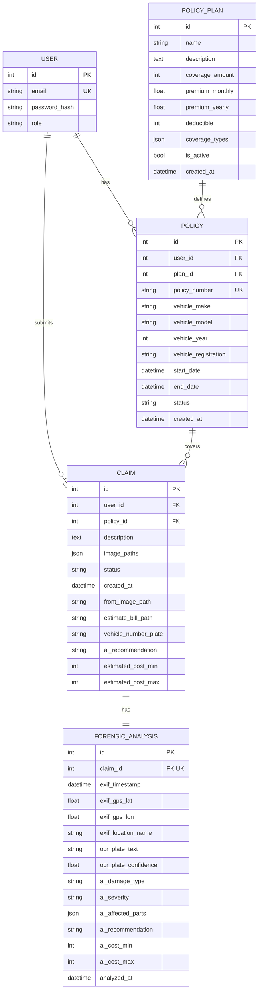

# Database ER Diagram - AutoClaim

## ER Diagram (5 Tables)

## Tables Summary

| Table | Columns | Purpose |
|-------|---------|---------|
| `users` | 4 | User accounts |
| `policy_plans` | 10 | Insurance plan templates |
| `policies` | 12 | User policy subscriptions |
| `claims` | 12 | Damage claims |
| `forensic_analyses` | 19 | AI analysis storage |

## Relationships
- User → Policies (1:N)
- User → Claims (1:N)
- PolicyPlan → Policies (1:N)
- Policy → Claims (1:N)
- Claim → ForensicAnalysis (1:1)

### Claim Table - OCR Fields
| Field | Type | Purpose |
|-------|------|---------|
| `vehicle_number_plate` | String | Extracted plate text |
| `plate_confidence` | Float | OCR confidence (0-1) |

### Claim Table - AI Analysis
| Field | Type | Purpose |
|-------|------|---------|
| `ai_analysis` | JSON | Full AI response |
| `ai_recommendation` | String | approve/review/reject |
| `estimated_cost_min` | Integer | Cost estimate low |
| `estimated_cost_max` | Integer | Cost estimate high |
